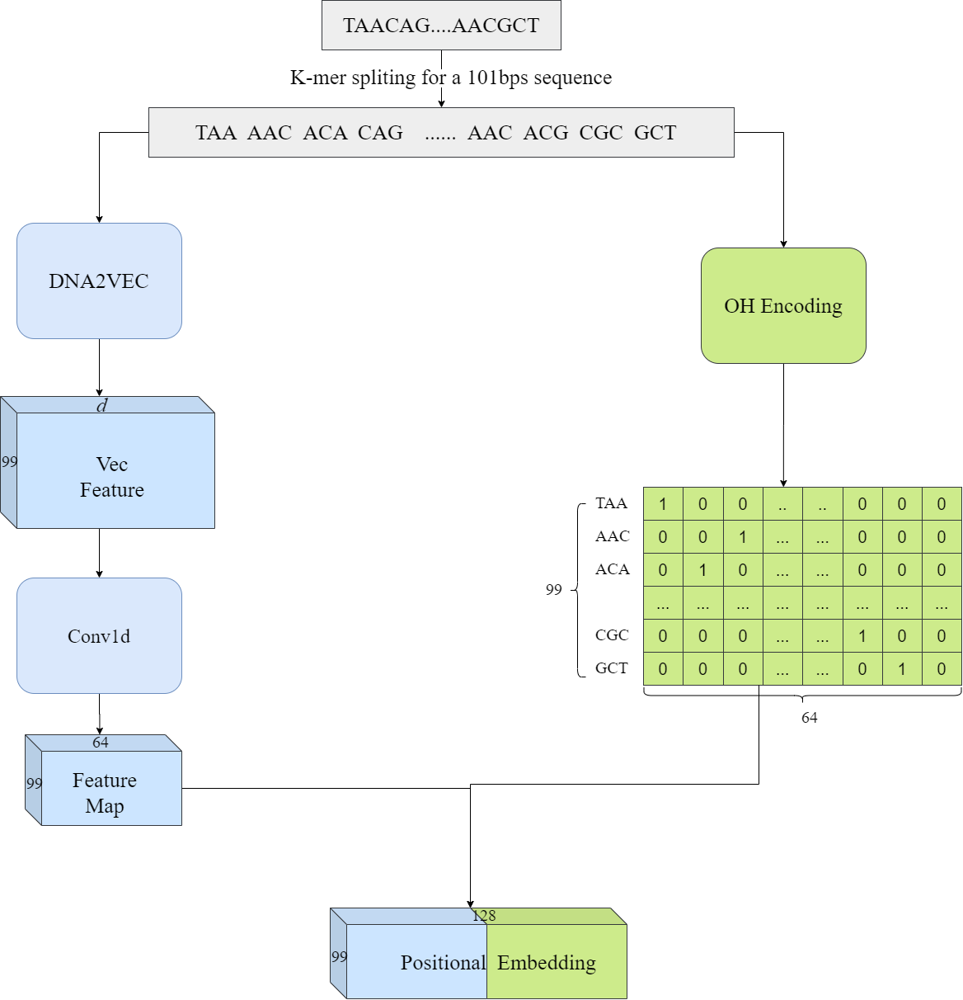
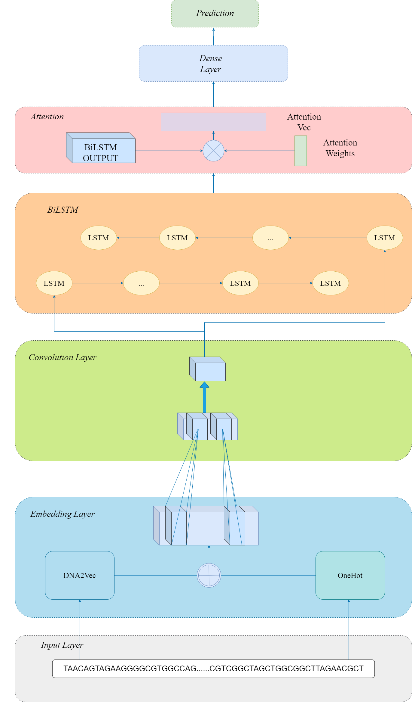

# DeepARC:An Attention based Hybrid Model for Predicting Transcription Factor Binding Site from Positional Embedded DNA Sequence

## Introduction
1.data:the demo dataset 
2.heat:visualizing the attention weight for sequence 
3.load_data.py:preprocessing the data 
4.models.py:deeparc model 
5.myDataSet.py:including data preprocess and embedding 
6.util.py: utils from sun  
7.main.py:train and test the model 
## webserver:
DeepARC can be visited at http://www.deeparc.denglab.org/

## model and embedding

---

